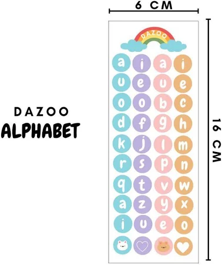

# dazoo.world
<!DOCTYPE html>
<html lang="id">
<head>
    <meta charset="UTF-8">
    <title>DAZOO.WORLD</title>
    
    
</head>
<body>

    <!-- HEADER -->
    <header>
        
        <h1>DAZOO.WORLD</h1>
        <h2>HOME OF CREATIVITY</h2>
    </header>

    <!-- NAVIGATION -->
    <nav>
        <a href="#" onclick="showPage('home')">HOMEPAGE</a>
        <a href="#" onclick="showPage('gallery')">GALERY</a>
        <a href="#" onclick="showPage('about')">ABOUT US</a>
        <a href="#" onclick="showPage('contact')">CONTACT US</a>
    </nav>

    <!-- HOMEPAGE SECTION -->
    <section id="home" class="active">
        <h2>Selamat Datang di Dazoo World</h2>
        
Dazoo World adalah rumah kreativitas. Kami menyediakan:

        <ul style="list-style: none; padding: 0;">
            <li>✔ Desain grafis menarik</li>
            <li>✔ Vector siap pakai</li>
            <li>✔ Galeri karya profesional</li>
        </ul>
        
        
<i>.</i>

    </section>

  

    <!-- GALLERY SECTION -->
    <section id="gallery">
        <h2>Produk kami</h2>
        

            
            
            
            
            
            
	    
            
        

    </section>

    <!-- ABOUT US SECTION -->
    <section id="about">
        <h2>Tentang Kami</h2>
        
Dazoo World mulai beroperasi sejak <strong>Januari 2020</strong>, pada masa awal pandemi COVID-19. Dengan semangat berkarya dari rumah, kami membangun komunitas desain untuk membantu bisnis dan personal branding di masa sulit.

        
Kami percaya bahwa desain visual yang kuat dapat menggerakkan perubahan, membangun merek, dan menghubungkan emosi.

        
    </section>

    <!-- CONTACT US SECTION -->
    <section id="contact">
        <h2>Hubungi Kami</h2>
        

            <a href="https://lynk.id/dazoo.world" target="_blank">🌐 Lynk ID: dazoo.world</a>
            <a href="https://instagram.com/dazoo.idn" target="_blank">📸 Instagram: @dazoo.idn</a>
            <a href="https://tiktok.com/@dazoo.world" target="_blank">🎵 TikTok: @dazoo.world</a>
        

    </section>

    <footer>
        &copy; 2020 - 2025 DAZOO.WORLD | All Rights Reserved
    </footer>

</body>
</html>
